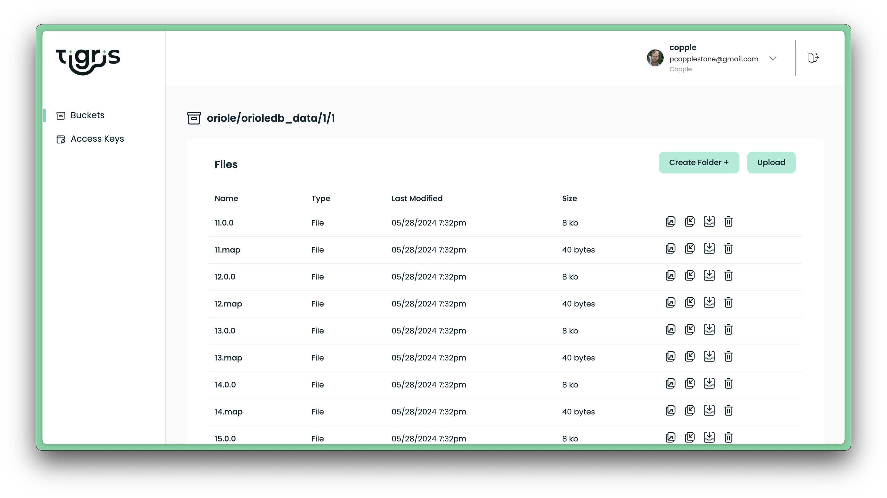
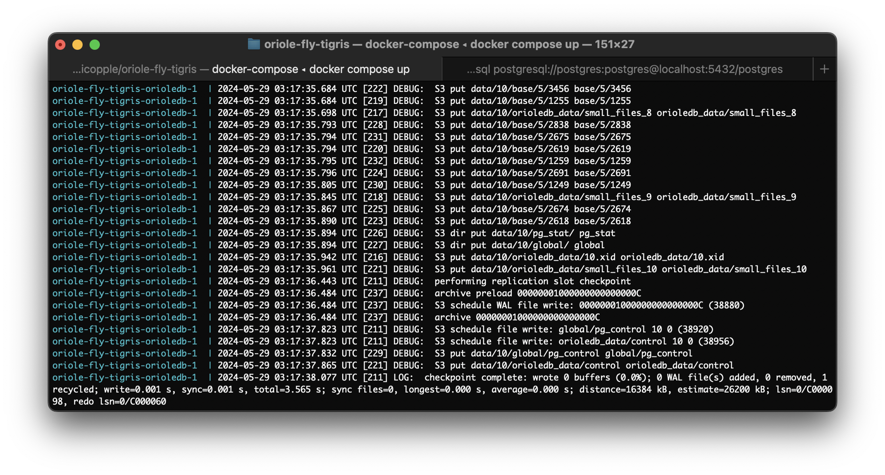

# Serverless Postgres (experimental)

Serverless Postgres using Oriole, Fly Machines, and Tigris for S3 Storage.

## Overview

This is a MVP for Serverless Postgres. 

1/ It uses [Fly.io](https://fly.io), which can automatically pause your database after all connections are released (and start it again when new connections join).

2/ It uses [Oriole](https://www.orioledb.com), a Postgres extension with [experimental support for S3 / Decoupled Storage](https://www.orioledb.com/docs/usage/decoupled-storage).

3/ It uses [Tigris](https://www.tigrisdata.com/), Globally Distributed S3-Compatible Object Storage. Oriole will automatically backup the data to Tigris using background workers.


## Usage

Make sure you already have an account with [Fly.io](https://fly.io).

### Step 1: initialize your S3 store 

```bash
fly storage create # Keep the credentials, you'll need them in the next step
```

### Step 2: set up credentials

Copy the sample env file and add your Tigris credentials from above:

```
cp .env.sample .env
```

### Step 3: Running Postgres locally

Start Postgres locally using `docker compose up`. 

(You may need to change the execute permissions on `./oriole/entrypoint-s3.sh`.)

### Step 4: Postgres usage

Enable the Oriole extension:

```sql
CREATE extension orioledb;
```

Create a table and insert data:

```sql
-- Create a table to store blog posts
CREATE TABLE blog_post (
    id int8 NOT NULL,
    title text NOT NULL COLLATE "C"
) USING orioledb;

-- Insert 1 million blog posts
INSERT INTO blog_post (select id, 'value' || id from generate_series (1,1000000) id);
```

After this, you the Oriole background workers will store the data in Tigris. You can login to Tigris using `fly storage dashboard` to view the data:



## Deploy to Fly

TBD

## Roadmap

I wouldn't recommend using this in production just yet. The goal of this repo is to showcase Oriole and start gathering feedback from anyone who wants to test it out. Please submit any Oriole bug reports to the [Oriole GitHub repo](https://github.com/orioledb/orioledb).

- [ ] **Deploy to Fly**. I still need to document the secure deployment steps for Fly.io (PRs welcome).
- [ ] **Distributed read replicas**. Oriole can have many read-replicas reading from the same S3 bucket. This is a good pairing with Fly.io that makes it simple to launch servers around the world. Not that if you do this it's _very important_ that the read replicas do not write to the same bucket as your primary or the data will become corrupted.
- [x] **Distributed data, without Postgres replication**. ~~Tigris will globally replicate objects that are less that 128 bytes. We would need to support global replication of all objects in this bucket if we want to create fast read replicas without Postgres replication.~~
  - Tigris replicates any object that requires fast access regardless of the size. It is possible to [control this per object](https://www.tigrisdata.com/docs/objects/object_regions/). I need to test this implementation but it should work "in theory".
- [ ] **Non-forked Postgres**. Oriole currently requires some [patches](https://www.orioledb.com/docs#patch-set) to the Postgres TAM API. The goal is to make them available in Postgres core.

## Oriole Decoupled Storage

Oriole has [experimental support](https://www.orioledb.com/docs/usage/decoupled-storage) for S3. 

Oriole is a table storage extension for Postgres. It is designed to be a drop-in replacement for Postgres' existing storage engine. The Oriole storage engine's reduction in disk IO is significant enough that it unlocks performant databases backed by S3 compatible blob storage.

Data most-often accessed is cached in local storage for performance. The data is synced with S3 asynchronously:



Read more in the [Oriole docs](https://www.orioledb.com/docs/usage/decoupled-storage).